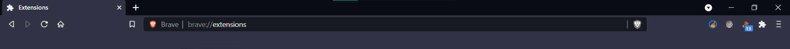

# Stack Overflow Visit Counter (Chrome Extension)

- The badge on the extension will be incremented everytime you visit StackOverflow
- It shows how many times you have visited StackOverflow for that current day.

# Execution
- Clone this repository
- Turn on developer mode in extensions on your browser
- Click 'Load Unpacked' button and select this directory
